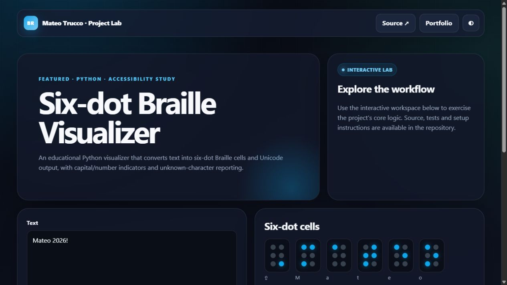

# Six-dot Braille Visualizer

An educational desktop visualizer with Unicode Braille cells and a six-dot view. It is not a certified transcription tool; punctuation and language conventions should be verified for any formal use.

## Features

- Capital and number indicators
- Spanish letters and common punctuation
- Unknown-character reporting
- Clipboard export
- Resize-aware visual board
- Unit-tested conversion logic

## Run

```bash
python main.py
```

## Test

```bash
python -m pytest tests
```

---

## Interactive preview

[](https://mateotrucco.github.io/braille_visualizer/)

**[Open the live experience](https://mateotrucco.github.io/braille_visualizer/)** · [View the portfolio](https://mateotrucco.github.io/)

## Engineering baseline

- Business logic separated from presentation
- Automated tests and GitHub Actions CI
- Responsive, keyboard-friendly browser experience
- MIT licensed and documented setup

